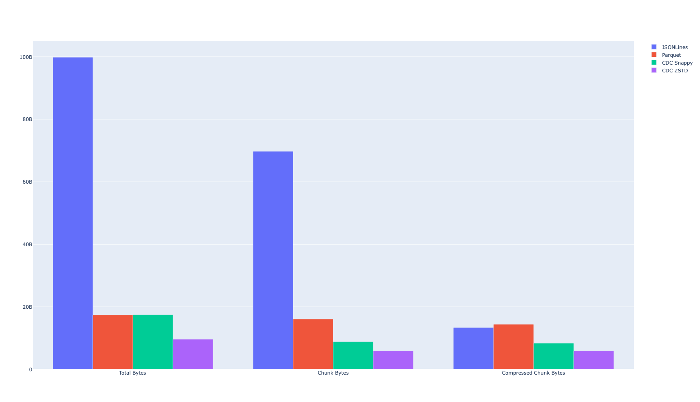

# Parquet Dedupe Estimator

This estimates the amount of chunk level dedupe available in a
collection of parquet files. All files will be chunked together
so if there are multiple versions of the file, all versions
should be provided together to see how much can be saved
using a CDC based content addressable storage system.

This tool is primarily designed to evaluate the deduplication
effectiveness of a content defined chunking feature in Apache Arrow.

# Arrow C++ / PyArrow Implementation

The implementation hasn't been merged upstream yet, it is available under
the https://github.com/kszucs/arrow/tree/content-defined-chunking branch.

The implementation maintains a gearhash based chunker for each leaf
column (in the ColumnWriter objects) which are persisent withing the
parquet file writer. As new Arrow Arrays are appended to the column
writers, the record shredded arrays `(def_levels, rep_levels, leaf_array)` 
are being fed into the chunker which identifies the chunk boundaries.

This means that the pages are not going to be split one a page's size
reaches the default page size limit (1MB) but rather when the chunker
identifies a chunk boundary. The resulting chunks are going to have 
uneven sizes, but going to be robust to data updates/inserts/deletes.

# Quick Start

Compile:

```bash
python setup.py develop
```

This will install a command line tool called `de`.

## Available Commands

Run the deduplication estimator on two or more files:

```bash
de dedup a.parquet b.parquet
```

Generate synthetic data and visualize deduplication:

```bash
de synthetic -s 1 -e 1 '{"a": "int", "b": "str", "c": ["float"]}'
```

Checkout all revisions of a file within a git repository:

```bash
❯ de revisions -d /tmp/datasets ~/Datasets/hub-stats/datasets.parquet
datasets.parquet has 194 revisions
Checking out 50a6ff0
Checking out 1ae78e6
Checking out 03613ea
...
```

Generate deduplication statistics for a directory of parquet files:

```bash
❯ de stats /tmp/datasets                                                        
Writing JSONLines files                                                          
100%|██████████████████████████████████████████| 194/194 [01:22<00:00,  2.36it/s]
Writing CDC Parquet files                                                        
100%|██████████████████████████████████████████| 194/194 [00:19<00:00,  9.91it/s]
100%|██████████████████████████████████████████| 194/194 [00:16<00:00, 11.91it/s]
Estimating deduplication for JSONLines                                           
Estimating deduplication for Parquet                                             
Estimating deduplication for CDC Snappy                                          
Estimating deduplication for CDC ZSTD                                            
┏━━━━━━━━━━━━┳━━━━━━━━━━━━┳━━━━━━━━━━━━┳━━━━━━━━━━━━━┳━━━━━━━━━━━━━┳━━━━━━━━━━━━┓
┃            ┃            ┃            ┃             ┃             ┃ Compressed ┃
┃            ┃            ┃            ┃  Compressed ┃ Deduplicat… ┃ Deduplica… ┃
┃ Title      ┃ Total Size ┃ Chunk Size ┃  Chunk Size ┃       Ratio ┃      Ratio ┃
┡━━━━━━━━━━━━╇━━━━━━━━━━━━╇━━━━━━━━━━━━╇━━━━━━━━━━━━━╇━━━━━━━━━━━━━╇━━━━━━━━━━━━┩
│ JSONLines  │   93.0 GiB │   64.9 GiB │    12.4 GiB │         70% │        13% │
│ Parquet    │   16.2 GiB │   15.0 GiB │    13.4 GiB │         93% │        83% │
│ CDC Snappy │   16.2 GiB │    8.2 GiB │     7.8 GiB │         51% │        48% │
│ CDC ZSTD   │    8.9 GiB │    5.5 GiB │     5.5 GiB │         62% │        62% │
└────────────┴────────────┴────────────┴─────────────┴─────────────┴────────────┘
```

It also generates a plot comparing the results:



# Parquet Deduplication

[Apache Parquet](https://parquet.apache.org/) is a columnar storage format that
is widely used in the data engineering community. It is a binary file format that
stores data in a columnar fashion, which allows for efficient reads and writes.

## Brief Description of the Implementation

TODO

# Results on Synthetic Data

The experiment can be reproduced by running the following command:

```bash
❯ de synthetic -s $S -e $E '{"a": "int"}'
```

This will generate `$S` million (2^20) records of schema `<a: int>` with variants
including `$E` edits (inserted/deleted/updated block of 10 records) evenly
distributed in the table and another variant with 5% of the records appended to
the end. The resulting parquet files have `$S` row groups.


## Results on Synthetic Data with {'a': 'int'} and 1Mi rows

The experiment can be reproduced by running the following command:

```bash
❯ de synthetic -s 1 -e 1 '{"a": "int"}'
❯ de synthetic -s 1 -e 2 '{"a": "int"}'
```
### Appended - 1Mi Rows / 1 Columns / 1 Edits:

| Compression | Vanilla Parquet                                                               | CDC Parquet                                                                 | JSONLines                                                               |
| :---------: | ----------------------------------------------------------------------------- | --------------------------------------------------------------------------- | ----------------------------------------------------------------------- |
|    None     |    |    |  |
|   Snappy    |  |  |                                                                                           |
|    ZSTD     |    |    |  |


### Updated - 1Mi Rows / 1 Columns / 1 Edits:

| Compression | Vanilla Parquet                                                               | CDC Parquet                                                                 | JSONLines                                                               |
| :---------: | ----------------------------------------------------------------------------- | --------------------------------------------------------------------------- | ----------------------------------------------------------------------- |
|    None     |    |    |  |
|   Snappy    |  |  |                                                                                           |
|    ZSTD     |    |    |  |
### Updated - 1Mi Rows / 1 Columns / 2 Edits:

| Compression | Vanilla Parquet                                                               | CDC Parquet                                                                 | JSONLines                                                               |
| :---------: | ----------------------------------------------------------------------------- | --------------------------------------------------------------------------- | ----------------------------------------------------------------------- |
|    None     |    |    |  |
|   Snappy    |  |  |                                                                                           |
|    ZSTD     |    |    |  |


### Inserted - 1Mi Rows / 1 Columns / 1 Edits:

| Compression | Vanilla Parquet                                                               | CDC Parquet                                                                 | JSONLines                                                               |
| :---------: | ----------------------------------------------------------------------------- | --------------------------------------------------------------------------- | ----------------------------------------------------------------------- |
|    None     |    |    |  |
|   Snappy    |  |  |                                                                                           |
|    ZSTD     |    |    |  |
### Inserted - 1Mi Rows / 1 Columns / 2 Edits:

| Compression | Vanilla Parquet                                                               | CDC Parquet                                                                 | JSONLines                                                               |
| :---------: | ----------------------------------------------------------------------------- | --------------------------------------------------------------------------- | ----------------------------------------------------------------------- |
|    None     |    |    |  |
|   Snappy    |  |  |                                                                                           |
|    ZSTD     |    |    |  |


### Deleted - 1Mi Rows / 1 Columns / 1 Edits:

| Compression | Vanilla Parquet                                                               | CDC Parquet                                                                 | JSONLines                                                               |
| :---------: | ----------------------------------------------------------------------------- | --------------------------------------------------------------------------- | ----------------------------------------------------------------------- |
|    None     |    |    |  |
|   Snappy    |  |  |                                                                                           |
|    ZSTD     |    |    |  |
### Deleted - 1Mi Rows / 1 Columns / 2 Edits:

| Compression | Vanilla Parquet                                                               | CDC Parquet                                                                 | JSONLines                                                               |
| :---------: | ----------------------------------------------------------------------------- | --------------------------------------------------------------------------- | ----------------------------------------------------------------------- |
|    None     |    |    |  |
|   Snappy    |  |  |                                                                                           |
|    ZSTD     |    |    |  |


## Results on Synthetic Data with {'a': 'int'} and 4Mi rows

The experiment can be reproduced by running the following command:

```bash
❯ de synthetic -s 4 -e 1 '{"a": "int"}'
❯ de synthetic -s 4 -e 2 '{"a": "int"}'
```
### Appended - 4Mi Rows / 1 Columns / 1 Edits:

| Compression | Vanilla Parquet                                                               | CDC Parquet                                                                 | JSONLines                                                               |
| :---------: | ----------------------------------------------------------------------------- | --------------------------------------------------------------------------- | ----------------------------------------------------------------------- |
|    None     |    |    |  |
|   Snappy    |  |  |                                                                                           |
|    ZSTD     |    |    |  |


### Updated - 4Mi Rows / 1 Columns / 1 Edits:

| Compression | Vanilla Parquet                                                               | CDC Parquet                                                                 | JSONLines                                                               |
| :---------: | ----------------------------------------------------------------------------- | --------------------------------------------------------------------------- | ----------------------------------------------------------------------- |
|    None     |    |    |  |
|   Snappy    |  |  |                                                                                           |
|    ZSTD     |    |    |  |
### Updated - 4Mi Rows / 1 Columns / 2 Edits:

| Compression | Vanilla Parquet                                                               | CDC Parquet                                                                 | JSONLines                                                               |
| :---------: | ----------------------------------------------------------------------------- | --------------------------------------------------------------------------- | ----------------------------------------------------------------------- |
|    None     |    |    |  |
|   Snappy    |  |  |                                                                                           |
|    ZSTD     |    |    |  |


### Inserted - 4Mi Rows / 1 Columns / 1 Edits:

| Compression | Vanilla Parquet                                                               | CDC Parquet                                                                 | JSONLines                                                               |
| :---------: | ----------------------------------------------------------------------------- | --------------------------------------------------------------------------- | ----------------------------------------------------------------------- |
|    None     |    |    |  |
|   Snappy    |  |  |                                                                                           |
|    ZSTD     |    |    |  |
### Inserted - 4Mi Rows / 1 Columns / 2 Edits:

| Compression | Vanilla Parquet                                                               | CDC Parquet                                                                 | JSONLines                                                               |
| :---------: | ----------------------------------------------------------------------------- | --------------------------------------------------------------------------- | ----------------------------------------------------------------------- |
|    None     |    |    |  |
|   Snappy    |  |  |                                                                                           |
|    ZSTD     |    |    |  |


### Deleted - 4Mi Rows / 1 Columns / 1 Edits:

| Compression | Vanilla Parquet                                                               | CDC Parquet                                                                 | JSONLines                                                               |
| :---------: | ----------------------------------------------------------------------------- | --------------------------------------------------------------------------- | ----------------------------------------------------------------------- |
|    None     |    |    |  |
|   Snappy    |  |  |                                                                                           |
|    ZSTD     |    |    |  |
### Deleted - 4Mi Rows / 1 Columns / 2 Edits:

| Compression | Vanilla Parquet                                                               | CDC Parquet                                                                 | JSONLines                                                               |
| :---------: | ----------------------------------------------------------------------------- | --------------------------------------------------------------------------- | ----------------------------------------------------------------------- |
|    None     |    |    |  |
|   Snappy    |  |  |                                                                                           |
|    ZSTD     |    |    |  |


## Results on Synthetic Data with {'a': 'int', 'b': 'str', 'c': ['float']} and 1Mi rows

The experiment can be reproduced by running the following command:

```bash
❯ de synthetic -s 1 -e 1 '{"a": "int", "b": "str", "c": ["float"]}'
❯ de synthetic -s 1 -e 2 '{"a": "int", "b": "str", "c": ["float"]}'
```
### Appended - 1Mi Rows / 3 Columns / 1 Edits:

| Compression | Vanilla Parquet                                                               | CDC Parquet                                                                 | JSONLines                                                               |
| :---------: | ----------------------------------------------------------------------------- | --------------------------------------------------------------------------- | ----------------------------------------------------------------------- |
|    None     |    |    |  |
|   Snappy    |  |  |                                                                                           |
|    ZSTD     |    |    |  |


### Updated - 1Mi Rows / 3 Columns / 1 Edits:

| Compression | Vanilla Parquet                                                               | CDC Parquet                                                                 | JSONLines                                                               |
| :---------: | ----------------------------------------------------------------------------- | --------------------------------------------------------------------------- | ----------------------------------------------------------------------- |
|    None     |    |    |  |
|   Snappy    |  |  |                                                                                           |
|    ZSTD     |    |    |  |
### Updated - 1Mi Rows / 3 Columns / 2 Edits:

| Compression | Vanilla Parquet                                                               | CDC Parquet                                                                 | JSONLines                                                               |
| :---------: | ----------------------------------------------------------------------------- | --------------------------------------------------------------------------- | ----------------------------------------------------------------------- |
|    None     |    |    |  |
|   Snappy    |  |  |                                                                                           |
|    ZSTD     |    |    |  |


### Updated_a - 1Mi Rows / 3 Columns / 1 Edits:

| Compression | Vanilla Parquet                                                               | CDC Parquet                                                                 | JSONLines                                                               |
| :---------: | ----------------------------------------------------------------------------- | --------------------------------------------------------------------------- | ----------------------------------------------------------------------- |
|    None     |    |    |  |
|   Snappy    |  |  |                                                                                           |
|    ZSTD     |    |    |  |
### Updated_a - 1Mi Rows / 3 Columns / 2 Edits:

| Compression | Vanilla Parquet                                                               | CDC Parquet                                                                 | JSONLines                                                               |
| :---------: | ----------------------------------------------------------------------------- | --------------------------------------------------------------------------- | ----------------------------------------------------------------------- |
|    None     |    |    |  |
|   Snappy    |  |  |                                                                                           |
|    ZSTD     |    |    |  |


### Updated_b - 1Mi Rows / 3 Columns / 1 Edits:

| Compression | Vanilla Parquet                                                               | CDC Parquet                                                                 | JSONLines                                                               |
| :---------: | ----------------------------------------------------------------------------- | --------------------------------------------------------------------------- | ----------------------------------------------------------------------- |
|    None     |    |    |  |
|   Snappy    |  |  |                                                                                           |
|    ZSTD     |    |    |  |
### Updated_b - 1Mi Rows / 3 Columns / 2 Edits:

| Compression | Vanilla Parquet                                                               | CDC Parquet                                                                 | JSONLines                                                               |
| :---------: | ----------------------------------------------------------------------------- | --------------------------------------------------------------------------- | ----------------------------------------------------------------------- |
|    None     |    |    |  |
|   Snappy    |  |  |                                                                                           |
|    ZSTD     |    |    |  |


### Updated_c - 1Mi Rows / 3 Columns / 1 Edits:

| Compression | Vanilla Parquet                                                               | CDC Parquet                                                                 | JSONLines                                                               |
| :---------: | ----------------------------------------------------------------------------- | --------------------------------------------------------------------------- | ----------------------------------------------------------------------- |
|    None     |    |    |  |
|   Snappy    |  |  |                                                                                           |
|    ZSTD     |    |    |  |
### Updated_c - 1Mi Rows / 3 Columns / 2 Edits:

| Compression | Vanilla Parquet                                                               | CDC Parquet                                                                 | JSONLines                                                               |
| :---------: | ----------------------------------------------------------------------------- | --------------------------------------------------------------------------- | ----------------------------------------------------------------------- |
|    None     |    |    |  |
|   Snappy    |  |  |                                                                                           |
|    ZSTD     |    |    |  |


### Inserted - 1Mi Rows / 3 Columns / 1 Edits:

| Compression | Vanilla Parquet                                                               | CDC Parquet                                                                 | JSONLines                                                               |
| :---------: | ----------------------------------------------------------------------------- | --------------------------------------------------------------------------- | ----------------------------------------------------------------------- |
|    None     |    |    |  |
|   Snappy    |  |  |                                                                                           |
|    ZSTD     |    |    |  |
### Inserted - 1Mi Rows / 3 Columns / 2 Edits:

| Compression | Vanilla Parquet                                                               | CDC Parquet                                                                 | JSONLines                                                               |
| :---------: | ----------------------------------------------------------------------------- | --------------------------------------------------------------------------- | ----------------------------------------------------------------------- |
|    None     |    |    |  |
|   Snappy    |  |  |                                                                                           |
|    ZSTD     |    |    |  |


### Deleted - 1Mi Rows / 3 Columns / 1 Edits:

| Compression | Vanilla Parquet                                                               | CDC Parquet                                                                 | JSONLines                                                               |
| :---------: | ----------------------------------------------------------------------------- | --------------------------------------------------------------------------- | ----------------------------------------------------------------------- |
|    None     |    |    |  |
|   Snappy    |  |  |                                                                                           |
|    ZSTD     |    |    |  |
### Deleted - 1Mi Rows / 3 Columns / 2 Edits:

| Compression | Vanilla Parquet                                                               | CDC Parquet                                                                 | JSONLines                                                               |
| :---------: | ----------------------------------------------------------------------------- | --------------------------------------------------------------------------- | ----------------------------------------------------------------------- |
|    None     |    |    |  |
|   Snappy    |  |  |                                                                                           |
|    ZSTD     |    |    |  |


## Results on Synthetic Data with {'a': 'int', 'b': 'str', 'c': ['float']} and 4Mi rows

The experiment can be reproduced by running the following command:

```bash
❯ de synthetic -s 4 -e 1 '{"a": "int", "b": "str", "c": ["float"]}'
❯ de synthetic -s 4 -e 2 '{"a": "int", "b": "str", "c": ["float"]}'
```
### Appended - 4Mi Rows / 3 Columns / 1 Edits:

| Compression | Vanilla Parquet                                                               | CDC Parquet                                                                 | JSONLines                                                               |
| :---------: | ----------------------------------------------------------------------------- | --------------------------------------------------------------------------- | ----------------------------------------------------------------------- |
|    None     |    |    |  |
|   Snappy    |  |  |                                                                                           |
|    ZSTD     |    |    |  |


### Updated - 4Mi Rows / 3 Columns / 1 Edits:

| Compression | Vanilla Parquet                                                               | CDC Parquet                                                                 | JSONLines                                                               |
| :---------: | ----------------------------------------------------------------------------- | --------------------------------------------------------------------------- | ----------------------------------------------------------------------- |
|    None     |    |    |  |
|   Snappy    |  |  |                                                                                           |
|    ZSTD     |    |    |  |
### Updated - 4Mi Rows / 3 Columns / 2 Edits:

| Compression | Vanilla Parquet                                                               | CDC Parquet                                                                 | JSONLines                                                               |
| :---------: | ----------------------------------------------------------------------------- | --------------------------------------------------------------------------- | ----------------------------------------------------------------------- |
|    None     |    |    |  |
|   Snappy    |  |  |                                                                                           |
|    ZSTD     |    |    |  |


### Updated_a - 4Mi Rows / 3 Columns / 1 Edits:

| Compression | Vanilla Parquet                                                               | CDC Parquet                                                                 | JSONLines                                                               |
| :---------: | ----------------------------------------------------------------------------- | --------------------------------------------------------------------------- | ----------------------------------------------------------------------- |
|    None     |    |    |  |
|   Snappy    |  |  |                                                                                           |
|    ZSTD     |    |    |  |
### Updated_a - 4Mi Rows / 3 Columns / 2 Edits:

| Compression | Vanilla Parquet                                                               | CDC Parquet                                                                 | JSONLines                                                               |
| :---------: | ----------------------------------------------------------------------------- | --------------------------------------------------------------------------- | ----------------------------------------------------------------------- |
|    None     |    |    |  |
|   Snappy    |  |  |                                                                                           |
|    ZSTD     |    |    |  |


### Updated_b - 4Mi Rows / 3 Columns / 1 Edits:

| Compression | Vanilla Parquet                                                               | CDC Parquet                                                                 | JSONLines                                                               |
| :---------: | ----------------------------------------------------------------------------- | --------------------------------------------------------------------------- | ----------------------------------------------------------------------- |
|    None     |    |    |  |
|   Snappy    |  |  |                                                                                           |
|    ZSTD     |    |    |  |
### Updated_b - 4Mi Rows / 3 Columns / 2 Edits:

| Compression | Vanilla Parquet                                                               | CDC Parquet                                                                 | JSONLines                                                               |
| :---------: | ----------------------------------------------------------------------------- | --------------------------------------------------------------------------- | ----------------------------------------------------------------------- |
|    None     |    |    |  |
|   Snappy    |  |  |                                                                                           |
|    ZSTD     |    |    |  |


### Updated_c - 4Mi Rows / 3 Columns / 1 Edits:

| Compression | Vanilla Parquet                                                               | CDC Parquet                                                                 | JSONLines                                                               |
| :---------: | ----------------------------------------------------------------------------- | --------------------------------------------------------------------------- | ----------------------------------------------------------------------- |
|    None     |    |    |  |
|   Snappy    |  |  |                                                                                           |
|    ZSTD     |    |    |  |
### Updated_c - 4Mi Rows / 3 Columns / 2 Edits:

| Compression | Vanilla Parquet                                                               | CDC Parquet                                                                 | JSONLines                                                               |
| :---------: | ----------------------------------------------------------------------------- | --------------------------------------------------------------------------- | ----------------------------------------------------------------------- |
|    None     |    |    |  |
|   Snappy    |  |  |                                                                                           |
|    ZSTD     |    |    |  |


### Inserted - 4Mi Rows / 3 Columns / 1 Edits:

| Compression | Vanilla Parquet                                                               | CDC Parquet                                                                 | JSONLines                                                               |
| :---------: | ----------------------------------------------------------------------------- | --------------------------------------------------------------------------- | ----------------------------------------------------------------------- |
|    None     |    |    |  |
|   Snappy    |  |  |                                                                                           |
|    ZSTD     |    |    |  |
### Inserted - 4Mi Rows / 3 Columns / 2 Edits:

| Compression | Vanilla Parquet                                                               | CDC Parquet                                                                 | JSONLines                                                               |
| :---------: | ----------------------------------------------------------------------------- | --------------------------------------------------------------------------- | ----------------------------------------------------------------------- |
|    None     |    |    |  |
|   Snappy    |  |  |                                                                                           |
|    ZSTD     |    |    |  |


### Deleted - 4Mi Rows / 3 Columns / 1 Edits:

| Compression | Vanilla Parquet                                                               | CDC Parquet                                                                 | JSONLines                                                               |
| :---------: | ----------------------------------------------------------------------------- | --------------------------------------------------------------------------- | ----------------------------------------------------------------------- |
|    None     |    |    |  |
|   Snappy    |  |  |                                                                                           |
|    ZSTD     |    |    |  |
### Deleted - 4Mi Rows / 3 Columns / 2 Edits:

| Compression | Vanilla Parquet                                                               | CDC Parquet                                                                 | JSONLines                                                               |
| :---------: | ----------------------------------------------------------------------------- | --------------------------------------------------------------------------- | ----------------------------------------------------------------------- |
|    None     |    |    |  |
|   Snappy    |  |  |                                                                                           |
|    ZSTD     |    |    |  |


