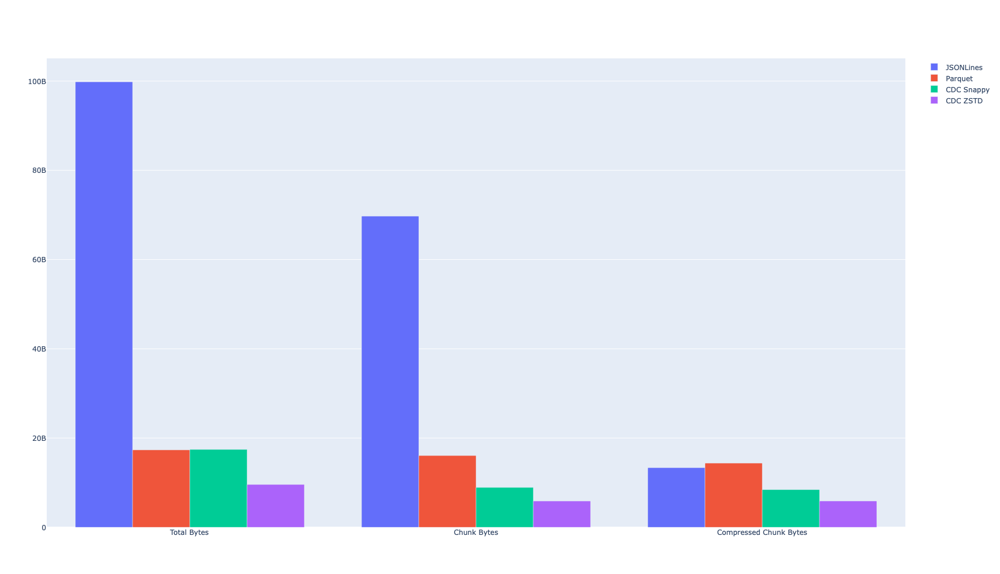
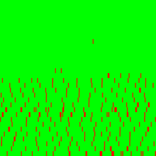
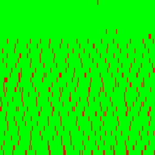
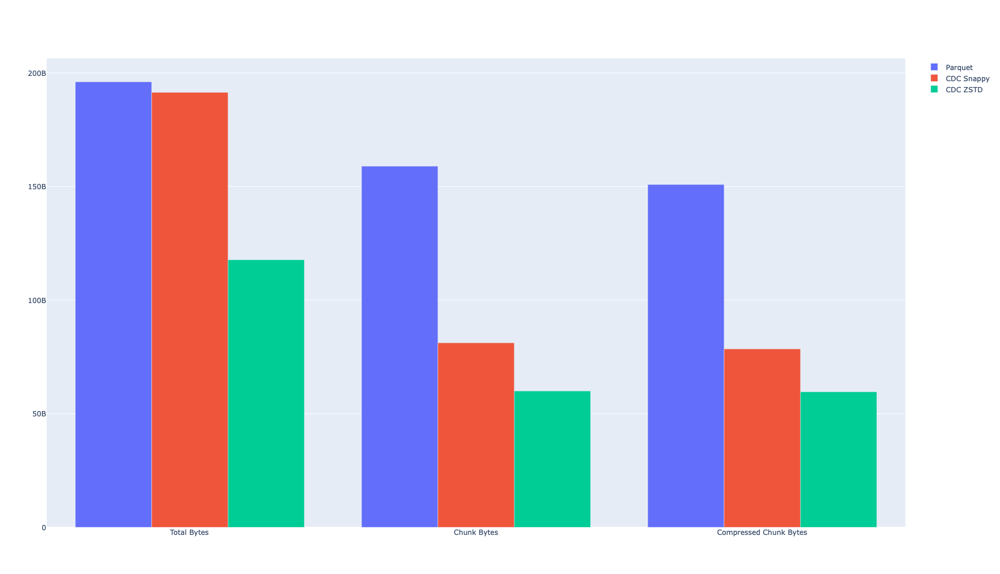

# Parquet Dedupe Estimator

This estimates the amount of chunk level dedupe available in a
collection of parquet files. All files will be chunked together
so if there are multiple versions of the file, all versions
should be provided together to see how much can be saved
using a CDC based content addressable storage system.

This tool is primarily designed to evaluate the deduplication
effectiveness of a content defined chunking feature in Apache Parquet.

Content Defined Chunking (CDC) is a technique used to divide data into
variable-sized chunks based on the content of the data itself, rather
than fixed-size boundaries. This method is particularly effective for
deduplication because it ensures that identical data segments are
consistently chunked in the same way, even if their positions within
the dataset change. By using CDC, systems can more accurately identify
and eliminate duplicate data, leading to significant storage savings.

[Apache Parquet](https://parquet.apache.org/) is a columnar storage format
that is widely used in the data engineering community. It is a binary file
format that stores data in a columnar fashion, which allows for efficient
reads and writes. In the context of Apache Parquet, CDC can enhance the
efficiency of data storage and retrieval by creating chunks that are robust
to data modifications such as updates, inserts, and deletes.


# Arrow C++ / PyArrow Implementation

The implementation has not yet been merged upstream and is currently
available on the following branch: [content-defined-chunking](https://github.com/kszucs/arrow/tree/content-defined-chunking).

This implementation introduces a gearhash-based chunker for each leaf column
within the `ColumnWriter` objects, which persist throughout the lifecycle of
the Parquet file writer. As new Arrow Arrays are appended to the column
writers, the record-shredded arrays `(def_levels, rep_levels, leaf_array)`
are processed by the chunker to identify chunk boundaries.

Unlike the traditional approach where pages are split once a page's size
reaches the default limit (typically 1MB), this implementation splits pages
based on the chunk boundaries identified by the chunker. Consequently, the
resulting chunks will have variable sizes but will be more resilient to data
modifications such as updates, inserts, and deletes. This method enhances the
robustness and efficiency of data storage and retrieval in Apache Parquet by
ensuring that identical data segments are consistently chunked in the same
manner, regardless of their position within the dataset.

# Quick Start

Compile:

```bash
maturin develop -r
```

This will install a command line tool called `de`.

## Available Commands

Run the deduplication estimator on two or more files:

```bash
de dedup a.parquet b.parquet
```

Generate synthetic data and visualize deduplication:

```bash
de synthetic -s 1 -e 1 '{"a": "int", "b": "str", "c": ["float"]}'
```

Checkout all revisions of a file within a git repository:

https://huggingface.co/datasets/cfahlgren1/hub-stats/blob/main/datasets.parquet

```bash
❯ de revisions -d /tmp/datasets ~/Datasets/hub-stats/datasets.parquet
datasets.parquet has 194 revisions
Checking out 50a6ff0
Checking out 1ae78e6
Checking out 03613ea
...
```

Generate deduplication statistics for a directory of parquet files:

```bash
❯ de stats --with-json /tmp/datasets
Writing JSONLines files
100%|██████████████████████████████████████████| 194/194 [01:22<00:00,  2.36it/s]
Writing CDC Parquet files
100%|██████████████████████████████████████████| 194/194 [00:19<00:00,  9.91it/s]
100%|██████████████████████████████████████████| 194/194 [00:16<00:00, 11.91it/s]
Estimating deduplication for JSONLines
Estimating deduplication for Parquet
Estimating deduplication for CDC Snappy
Estimating deduplication for CDC ZSTD
┏━━━━━━━━━━━━┳━━━━━━━━━━━━┳━━━━━━━━━━━━┳━━━━━━━━━━━━━┳━━━━━━━━━━━━━┳━━━━━━━━━━━━┓
┃            ┃            ┃            ┃             ┃             ┃ Compressed ┃
┃            ┃            ┃            ┃  Compressed ┃ Deduplicat… ┃ Deduplica… ┃
┃ Title      ┃ Total Size ┃ Chunk Size ┃  Chunk Size ┃       Ratio ┃      Ratio ┃
┡━━━━━━━━━━━━╇━━━━━━━━━━━━╇━━━━━━━━━━━━╇━━━━━━━━━━━━━╇━━━━━━━━━━━━━╇━━━━━━━━━━━━┩
│ JSONLines  │   93.0 GiB │   64.9 GiB │    12.4 GiB │         70% │        13% │
│ Parquet    │   16.2 GiB │   15.0 GiB │    13.4 GiB │         93% │        83% │
│ CDC Snappy │   16.2 GiB │    8.2 GiB │     7.8 GiB │         51% │        48% │
│ CDC ZSTD   │    8.9 GiB │    5.5 GiB │     5.5 GiB │         62% │        62% │
└────────────┴────────────┴────────────┴─────────────┴─────────────┴────────────┘
```

It also generates a plot comparing the results:




# Results on Synthetic Data

The experiment can be reproduced by running the following command:

```bash
❯ de synthetic -s $S -e $E '{"a": "int"}'
```

This will generate `$S` million (2^20) records of schema `<a: int>` with variants
including `$E` edits (inserted/deleted/updated block of 10 records) evenly
distributed in the table and another variant with 5% of the records appended to
the end. The resulting parquet files have `$S` row groups.

The tool also generates .jsonlines files for comparison since content defined
chunking is well suited for row major formats.


## Results on Synthetic Data with {'a': 'int'} and 1Mi rows

The experiment can be reproduced by running the following command:

```bash
❯ de synthetic -s 1 -e 1 '{"a": "int"}'
❯ de synthetic -s 1 -e 2 '{"a": "int"}'
```
### Appended - 1Mi Rows / 1 Columns / 1 Edits:

| Compression | Vanilla Parquet                                                               | CDC Parquet                                                                 | JSONLines                                                               |
| :---------: | ----------------------------------------------------------------------------- | --------------------------------------------------------------------------- | ----------------------------------------------------------------------- |
|    None     |    |    |  |
|   Snappy    |  |  |                                                                                           |
|    ZSTD     |    |    |  |


### Updated - 1Mi Rows / 1 Columns / 1 Edits:

| Compression | Vanilla Parquet                                                               | CDC Parquet                                                                 | JSONLines                                                               |
| :---------: | ----------------------------------------------------------------------------- | --------------------------------------------------------------------------- | ----------------------------------------------------------------------- |
|    None     |    |    |  |
|   Snappy    |  |  |                                                                                           |
|    ZSTD     |    |    |  |
### Updated - 1Mi Rows / 1 Columns / 2 Edits:

| Compression | Vanilla Parquet                                                               | CDC Parquet                                                                 | JSONLines                                                               |
| :---------: | ----------------------------------------------------------------------------- | --------------------------------------------------------------------------- | ----------------------------------------------------------------------- |
|    None     |    |    |  |
|   Snappy    |  |  |                                                                                           |
|    ZSTD     |    |    |  |


### Inserted - 1Mi Rows / 1 Columns / 1 Edits:

| Compression | Vanilla Parquet                                                               | CDC Parquet                                                                 | JSONLines                                                               |
| :---------: | ----------------------------------------------------------------------------- | --------------------------------------------------------------------------- | ----------------------------------------------------------------------- |
|    None     |    |    |  |
|   Snappy    |  |  |                                                                                           |
|    ZSTD     |    |    |  |
### Inserted - 1Mi Rows / 1 Columns / 2 Edits:

| Compression | Vanilla Parquet                                                               | CDC Parquet                                                                 | JSONLines                                                               |
| :---------: | ----------------------------------------------------------------------------- | --------------------------------------------------------------------------- | ----------------------------------------------------------------------- |
|    None     |    |    |  |
|   Snappy    |  |  |                                                                                           |
|    ZSTD     |    |    |  |


### Deleted - 1Mi Rows / 1 Columns / 1 Edits:

| Compression | Vanilla Parquet                                                               | CDC Parquet                                                                 | JSONLines                                                               |
| :---------: | ----------------------------------------------------------------------------- | --------------------------------------------------------------------------- | ----------------------------------------------------------------------- |
|    None     |    |    |  |
|   Snappy    |  |  |                                                                                           |
|    ZSTD     |    |    |  |
### Deleted - 1Mi Rows / 1 Columns / 2 Edits:

| Compression | Vanilla Parquet                                                               | CDC Parquet                                                                 | JSONLines                                                               |
| :---------: | ----------------------------------------------------------------------------- | --------------------------------------------------------------------------- | ----------------------------------------------------------------------- |
|    None     |    |    |  |
|   Snappy    |  |  |                                                                                           |
|    ZSTD     |    |    |  |


## Results on Synthetic Data with {'a': 'int'} and 4Mi rows

The experiment can be reproduced by running the following command:

```bash
❯ de synthetic -s 4 -e 1 '{"a": "int"}'
❯ de synthetic -s 4 -e 2 '{"a": "int"}'
```
### Appended - 4Mi Rows / 1 Columns / 1 Edits:

| Compression | Vanilla Parquet                                                               | CDC Parquet                                                                 | JSONLines                                                               |
| :---------: | ----------------------------------------------------------------------------- | --------------------------------------------------------------------------- | ----------------------------------------------------------------------- |
|    None     |    |    |  |
|   Snappy    |  |  |                                                                                           |
|    ZSTD     |    |    |  |


### Updated - 4Mi Rows / 1 Columns / 1 Edits:

| Compression | Vanilla Parquet                                                               | CDC Parquet                                                                 | JSONLines                                                               |
| :---------: | ----------------------------------------------------------------------------- | --------------------------------------------------------------------------- | ----------------------------------------------------------------------- |
|    None     |    |    |  |
|   Snappy    |  |  |                                                                                           |
|    ZSTD     |    |    |  |
### Updated - 4Mi Rows / 1 Columns / 2 Edits:

| Compression | Vanilla Parquet                                                               | CDC Parquet                                                                 | JSONLines                                                               |
| :---------: | ----------------------------------------------------------------------------- | --------------------------------------------------------------------------- | ----------------------------------------------------------------------- |
|    None     |    |    |  |
|   Snappy    |  |  |                                                                                           |
|    ZSTD     |    |    |  |


### Inserted - 4Mi Rows / 1 Columns / 1 Edits:

| Compression | Vanilla Parquet                                                               | CDC Parquet                                                                 | JSONLines                                                               |
| :---------: | ----------------------------------------------------------------------------- | --------------------------------------------------------------------------- | ----------------------------------------------------------------------- |
|    None     |    |    |  |
|   Snappy    |  |  |                                                                                           |
|    ZSTD     |    |    |  |
### Inserted - 4Mi Rows / 1 Columns / 2 Edits:

| Compression | Vanilla Parquet                                                               | CDC Parquet                                                                 | JSONLines                                                               |
| :---------: | ----------------------------------------------------------------------------- | --------------------------------------------------------------------------- | ----------------------------------------------------------------------- |
|    None     |    |    |  |
|   Snappy    |  |  |                                                                                           |
|    ZSTD     |    |    |  |


### Deleted - 4Mi Rows / 1 Columns / 1 Edits:

| Compression | Vanilla Parquet                                                               | CDC Parquet                                                                 | JSONLines                                                               |
| :---------: | ----------------------------------------------------------------------------- | --------------------------------------------------------------------------- | ----------------------------------------------------------------------- |
|    None     |    |    |  |
|   Snappy    |  |  |                                                                                           |
|    ZSTD     |    |    |  |
### Deleted - 4Mi Rows / 1 Columns / 2 Edits:

| Compression | Vanilla Parquet                                                               | CDC Parquet                                                                 | JSONLines                                                               |
| :---------: | ----------------------------------------------------------------------------- | --------------------------------------------------------------------------- | ----------------------------------------------------------------------- |
|    None     |    |    |  |
|   Snappy    |  |  |                                                                                           |
|    ZSTD     |    |    |  |


## Results on Synthetic Data with {'a': 'int', 'b': 'str', 'c': ['float']} and 1Mi rows

The experiment can be reproduced by running the following command:

```bash
❯ de synthetic -s 1 -e 1 '{"a": "int", "b": "str", "c": ["float"]}'
❯ de synthetic -s 1 -e 2 '{"a": "int", "b": "str", "c": ["float"]}'
```
### Appended - 1Mi Rows / 3 Columns / 1 Edits:

| Compression | Vanilla Parquet                                                               | CDC Parquet                                                                 | JSONLines                                                               |
| :---------: | ----------------------------------------------------------------------------- | --------------------------------------------------------------------------- | ----------------------------------------------------------------------- |
|    None     |    |    |  |
|   Snappy    |  |  |                                                                                           |
|    ZSTD     |    |    |  |


### Updated - 1Mi Rows / 3 Columns / 1 Edits:

| Compression | Vanilla Parquet                                                               | CDC Parquet                                                                 | JSONLines                                                               |
| :---------: | ----------------------------------------------------------------------------- | --------------------------------------------------------------------------- | ----------------------------------------------------------------------- |
|    None     |    |    |  |
|   Snappy    |  |  |                                                                                           |
|    ZSTD     |    |    |  |
### Updated - 1Mi Rows / 3 Columns / 2 Edits:

| Compression | Vanilla Parquet                                                               | CDC Parquet                                                                 | JSONLines                                                               |
| :---------: | ----------------------------------------------------------------------------- | --------------------------------------------------------------------------- | ----------------------------------------------------------------------- |
|    None     |    |    |  |
|   Snappy    |  |  |                                                                                           |
|    ZSTD     |    |    |  |


### Updated_a - 1Mi Rows / 3 Columns / 1 Edits:

| Compression | Vanilla Parquet                                                               | CDC Parquet                                                                 | JSONLines                                                               |
| :---------: | ----------------------------------------------------------------------------- | --------------------------------------------------------------------------- | ----------------------------------------------------------------------- |
|    None     |    |    |  |
|   Snappy    |  |  |                                                                                           |
|    ZSTD     |    |    |  |
### Updated_a - 1Mi Rows / 3 Columns / 2 Edits:

| Compression | Vanilla Parquet                                                               | CDC Parquet                                                                 | JSONLines                                                               |
| :---------: | ----------------------------------------------------------------------------- | --------------------------------------------------------------------------- | ----------------------------------------------------------------------- |
|    None     |    |    |  |
|   Snappy    |  |  |                                                                                           |
|    ZSTD     |    |    |  |


### Updated_b - 1Mi Rows / 3 Columns / 1 Edits:

| Compression | Vanilla Parquet                                                               | CDC Parquet                                                                 | JSONLines                                                               |
| :---------: | ----------------------------------------------------------------------------- | --------------------------------------------------------------------------- | ----------------------------------------------------------------------- |
|    None     |    |    |  |
|   Snappy    |  |  |                                                                                           |
|    ZSTD     |    |    |  |
### Updated_b - 1Mi Rows / 3 Columns / 2 Edits:

| Compression | Vanilla Parquet                                                               | CDC Parquet                                                                 | JSONLines                                                               |
| :---------: | ----------------------------------------------------------------------------- | --------------------------------------------------------------------------- | ----------------------------------------------------------------------- |
|    None     |    |    |  |
|   Snappy    |  |  |                                                                                           |
|    ZSTD     |    |    |  |


### Updated_c - 1Mi Rows / 3 Columns / 1 Edits:

| Compression | Vanilla Parquet                                                               | CDC Parquet                                                                 | JSONLines                                                               |
| :---------: | ----------------------------------------------------------------------------- | --------------------------------------------------------------------------- | ----------------------------------------------------------------------- |
|    None     |    |    |  |
|   Snappy    |  |  |                                                                                           |
|    ZSTD     |    |    |  |
### Updated_c - 1Mi Rows / 3 Columns / 2 Edits:

| Compression | Vanilla Parquet                                                               | CDC Parquet                                                                 | JSONLines                                                               |
| :---------: | ----------------------------------------------------------------------------- | --------------------------------------------------------------------------- | ----------------------------------------------------------------------- |
|    None     |    |    |  |
|   Snappy    |  |  |                                                                                           |
|    ZSTD     |    |    |  |


### Inserted - 1Mi Rows / 3 Columns / 1 Edits:

| Compression | Vanilla Parquet                                                               | CDC Parquet                                                                 | JSONLines                                                               |
| :---------: | ----------------------------------------------------------------------------- | --------------------------------------------------------------------------- | ----------------------------------------------------------------------- |
|    None     |    |    |  |
|   Snappy    |  |  |                                                                                           |
|    ZSTD     |    |    |  |
### Inserted - 1Mi Rows / 3 Columns / 2 Edits:

| Compression | Vanilla Parquet                                                               | CDC Parquet                                                                 | JSONLines                                                               |
| :---------: | ----------------------------------------------------------------------------- | --------------------------------------------------------------------------- | ----------------------------------------------------------------------- |
|    None     |    |    |  |
|   Snappy    |  |  |                                                                                           |
|    ZSTD     |    |    |  |


### Deleted - 1Mi Rows / 3 Columns / 1 Edits:

| Compression | Vanilla Parquet                                                               | CDC Parquet                                                                 | JSONLines                                                               |
| :---------: | ----------------------------------------------------------------------------- | --------------------------------------------------------------------------- | ----------------------------------------------------------------------- |
|    None     |    |    |  |
|   Snappy    |  |  |                                                                                           |
|    ZSTD     |    |    |  |
### Deleted - 1Mi Rows / 3 Columns / 2 Edits:

| Compression | Vanilla Parquet                                                               | CDC Parquet                                                                 | JSONLines                                                               |
| :---------: | ----------------------------------------------------------------------------- | --------------------------------------------------------------------------- | ----------------------------------------------------------------------- |
|    None     |    |    |  |
|   Snappy    |  |  |                                                                                           |
|    ZSTD     |    |    |  |


## Results on Synthetic Data with {'a': 'int', 'b': 'str', 'c': ['float']} and 4Mi rows

The experiment can be reproduced by running the following command:

```bash
❯ de synthetic -s 4 -e 1 '{"a": "int", "b": "str", "c": ["float"]}'
❯ de synthetic -s 4 -e 2 '{"a": "int", "b": "str", "c": ["float"]}'
```
### Appended - 4Mi Rows / 3 Columns / 1 Edits:

| Compression | Vanilla Parquet                                                               | CDC Parquet                                                                 | JSONLines                                                               |
| :---------: | ----------------------------------------------------------------------------- | --------------------------------------------------------------------------- | ----------------------------------------------------------------------- |
|    None     |    |    |  |
|   Snappy    |  |  |                                                                                           |
|    ZSTD     |    |    |  |


### Updated - 4Mi Rows / 3 Columns / 1 Edits:

| Compression | Vanilla Parquet                                                               | CDC Parquet                                                                 | JSONLines                                                               |
| :---------: | ----------------------------------------------------------------------------- | --------------------------------------------------------------------------- | ----------------------------------------------------------------------- |
|    None     |    |    |  |
|   Snappy    |  |  |                                                                                           |
|    ZSTD     |    |    |  |
### Updated - 4Mi Rows / 3 Columns / 2 Edits:

| Compression | Vanilla Parquet                                                               | CDC Parquet                                                                 | JSONLines                                                               |
| :---------: | ----------------------------------------------------------------------------- | --------------------------------------------------------------------------- | ----------------------------------------------------------------------- |
|    None     |    |    |  |
|   Snappy    |  |  |                                                                                           |
|    ZSTD     |    |    |  |


### Updated_a - 4Mi Rows / 3 Columns / 1 Edits:

| Compression | Vanilla Parquet                                                               | CDC Parquet                                                                 | JSONLines                                                               |
| :---------: | ----------------------------------------------------------------------------- | --------------------------------------------------------------------------- | ----------------------------------------------------------------------- |
|    None     |    |    |  |
|   Snappy    |  |  |                                                                                           |
|    ZSTD     |    |    |  |
### Updated_a - 4Mi Rows / 3 Columns / 2 Edits:

| Compression | Vanilla Parquet                                                               | CDC Parquet                                                                 | JSONLines                                                               |
| :---------: | ----------------------------------------------------------------------------- | --------------------------------------------------------------------------- | ----------------------------------------------------------------------- |
|    None     |    |    |  |
|   Snappy    |  |  |                                                                                           |
|    ZSTD     |    |    |  |


### Updated_b - 4Mi Rows / 3 Columns / 1 Edits:

| Compression | Vanilla Parquet                                                               | CDC Parquet                                                                 | JSONLines                                                               |
| :---------: | ----------------------------------------------------------------------------- | --------------------------------------------------------------------------- | ----------------------------------------------------------------------- |
|    None     |    |    |  |
|   Snappy    |  |  |                                                                                           |
|    ZSTD     |    |    |  |
### Updated_b - 4Mi Rows / 3 Columns / 2 Edits:

| Compression | Vanilla Parquet                                                               | CDC Parquet                                                                 | JSONLines                                                               |
| :---------: | ----------------------------------------------------------------------------- | --------------------------------------------------------------------------- | ----------------------------------------------------------------------- |
|    None     |    |    |  |
|   Snappy    |  |  |                                                                                           |
|    ZSTD     |    |    |  |


### Updated_c - 4Mi Rows / 3 Columns / 1 Edits:

| Compression | Vanilla Parquet                                                               | CDC Parquet                                                                 | JSONLines                                                               |
| :---------: | ----------------------------------------------------------------------------- | --------------------------------------------------------------------------- | ----------------------------------------------------------------------- |
|    None     |    |    |  |
|   Snappy    |  |  |                                                                                           |
|    ZSTD     |    |    |  |
### Updated_c - 4Mi Rows / 3 Columns / 2 Edits:

| Compression | Vanilla Parquet                                                               | CDC Parquet                                                                 | JSONLines                                                               |
| :---------: | ----------------------------------------------------------------------------- | --------------------------------------------------------------------------- | ----------------------------------------------------------------------- |
|    None     |    |    |  |
|   Snappy    |  |  |                                                                                           |
|    ZSTD     |    |    |  |


### Inserted - 4Mi Rows / 3 Columns / 1 Edits:

| Compression | Vanilla Parquet                                                               | CDC Parquet                                                                 | JSONLines                                                               |
| :---------: | ----------------------------------------------------------------------------- | --------------------------------------------------------------------------- | ----------------------------------------------------------------------- |
|    None     |    |    |  |
|   Snappy    |  |  |                                                                                           |
|    ZSTD     |    |    |  |
### Inserted - 4Mi Rows / 3 Columns / 2 Edits:

| Compression | Vanilla Parquet                                                               | CDC Parquet                                                                 | JSONLines                                                               |
| :---------: | ----------------------------------------------------------------------------- | --------------------------------------------------------------------------- | ----------------------------------------------------------------------- |
|    None     |    |    |  |
|   Snappy    |  |  |                                                                                           |
|    ZSTD     |    |    |  |


### Deleted - 4Mi Rows / 3 Columns / 1 Edits:

| Compression | Vanilla Parquet                                                               | CDC Parquet                                                                 | JSONLines                                                               |
| :---------: | ----------------------------------------------------------------------------- | --------------------------------------------------------------------------- | ----------------------------------------------------------------------- |
|    None     |    |    |  |
|   Snappy    |  |  |                                                                                           |
|    ZSTD     |    |    |  |
### Deleted - 4Mi Rows / 3 Columns / 2 Edits:

| Compression | Vanilla Parquet                                                               | CDC Parquet                                                                 | JSONLines                                                               |
| :---------: | ----------------------------------------------------------------------------- | --------------------------------------------------------------------------- | ----------------------------------------------------------------------- |
|    None     |    |    |  |
|   Snappy    |  |  |                                                                                           |
|    ZSTD     |    |    |  |


## Datasets Results: cfahlgren1/hub-stats/spaces.parquet

https://huggingface.co/datasets/cfahlgren1/hub-stats/blob/main/spaces.parquet

Checkout all revisions of spaces.parquet:

```bash
❯ GIT_LFS_SKIP_SMUDGE=1 git clone https://huggingface.co/datasets/cfahlgren1/hub-stats.git ~/Datasets/hub-stats
❯ de revisions -d /tmp/spaces ~/Datasets/hub-stats/spaces.parquet
```

This will take some time depending on the network speed. Then the evaluation
which automatically:
1. Converts the parquet files to JSONLines
2. Converts the parquet files to CDC Parquet with Snappy and ZSTD compressions
3. Estimates the deduplication ratio for each format
4. Prints the results and generates a plot for comparison

```bash
❯ de stats --with-json /tmp/spaces
Writing JSONLines files
100%|██████████████████████████████████████████| 193/193 [07:14<00:00,  2.25s/it]
Writing CDC Parquet files
100%|██████████████████████████████████████████| 193/193 [00:38<00:00,  4.97it/s]
100%|██████████████████████████████████████████| 193/193 [00:31<00:00,  6.12it/s]
Estimating deduplication for JSONLines
Estimating deduplication for Parquet
Estimating deduplication for CDC Snappy
Estimating deduplication for CDC ZSTD
┏━━━━━━━━━━━━┳━━━━━━━━━━━━┳━━━━━━━━━━━━┳━━━━━━━━━━━━━┳━━━━━━━━━━━━━┳━━━━━━━━━━━━┓
┃            ┃            ┃            ┃             ┃             ┃ Compressed ┃
┃            ┃            ┃            ┃  Compressed ┃ Deduplicat… ┃ Deduplica… ┃
┃ Title      ┃ Total Size ┃ Chunk Size ┃  Chunk Size ┃       Ratio ┃      Ratio ┃
┡━━━━━━━━━━━━╇━━━━━━━━━━━━╇━━━━━━━━━━━━╇━━━━━━━━━━━━━╇━━━━━━━━━━━━━╇━━━━━━━━━━━━┩
│ JSONLines  │  157.8 GiB │   12.8 GiB │     2.7 GiB │          8% │         2% │
│ Parquet    │   24.3 GiB │   23.5 GiB │    22.6 GiB │         97% │        93% │
│ CDC Snappy │   24.3 GiB │    8.8 GiB │     8.5 GiB │         36% │        35% │
│ CDC ZSTD   │   15.3 GiB │    6.2 GiB │     6.2 GiB │         41% │        41% │
└────────────┴────────────┴────────────┴─────────────┴─────────────┴────────────┘
```


## Datasets Results: openfoodfacts/product-database/food.parquet

```bash
❯ GIT_LFS_SKIP_SMUDGE=1 git clone https://huggingface.co/datasets/openfoodfacts/product-database.git ~/Datasets/product-database
❯ de revisions -d /tmp/food ~/Datasets/product-database/food.parquet
food.parquet has 32 revisions
Checking out 2e19b51
Checking out 1f84d31
Checking out d31d108
Checking out 9cd809c
Checking out 41e5f38
Checking out 9a30ddd
...
```

Generate the stats but skip generating the JSONLines files since the compressed
parquet files are around 6GB each so the uncompressed JSONLines files would
require too much disk space.

```bash
❯ de stats /tmp/food 
Estimating deduplication for Parquet
Estimating deduplication for CDC Snappy
Estimating deduplication for CDC ZSTD
┏━━━━━━━━━━━━┳━━━━━━━━━━━━┳━━━━━━━━━━━━┳━━━━━━━━━━━━━┳━━━━━━━━━━━━━┳━━━━━━━━━━━━┓
┃            ┃            ┃            ┃             ┃             ┃ Compressed ┃
┃            ┃            ┃            ┃  Compressed ┃ Deduplicat… ┃ Deduplica… ┃
┃ Title      ┃ Total Size ┃ Chunk Size ┃  Chunk Size ┃       Ratio ┃      Ratio ┃
┡━━━━━━━━━━━━╇━━━━━━━━━━━━╇━━━━━━━━━━━━╇━━━━━━━━━━━━━╇━━━━━━━━━━━━━╇━━━━━━━━━━━━┩
│ Parquet    │  182.6 GiB │  148.0 GiB │   140.5 GiB │         81% │        77% │
│ CDC Snappy │  178.3 GiB │   75.5 GiB │    73.0 GiB │         42% │        41% │
│ CDC ZSTD   │  109.6 GiB │   55.9 GiB │    55.6 GiB │         51% │        51% │
└────────────┴────────────┴────────────┴─────────────┴─────────────┴────────────┘
```

