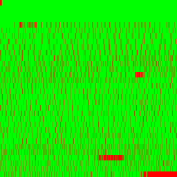

# Parquet Content-Defined Chunking


Apache Parquet is a columnar storage format that is widely used in the
data engineering community.

As Hugging Face hosts nearly 11PB of datasets with Parquet files alone
accounting for over 2.2PB of that storage, optimizing Parquet storage is
of high priority. Hugging Face has introduced a new storage layer called
[Xet](https://huggingface.co/blog/xet-on-the-hub) that leverages
content-defined chunking to efficiently deduplicate chunks of data
reducing storage costs and improving download/upload speeds.

While Xet is format agnostic, Parquet’s layout and column-chunk (data
page) based compression can produce entirely different byte-level
representations for data with minor changes, leading to suboptimal
deduplication performance. To address this, the Parquet files should be
written in a way that minimizes the byte-level differences between
similar data, which is where content-defined chunking (CDC) comes into
play.

Let’s explore the performance benefits of the new Parquet CDC feature
used alongside Hugging Face’s Xet storage layer.

## Data Preparation

For demonstration purposes, we will use a manageable sized subset of
[OpenOrca](https://huggingface.co/datasets/Open-Orca/OpenOrca) dataset.

``` python
import numpy as np
import pyarrow as pa
import pyarrow.compute as pc
import pyarrow.parquet as pq
from huggingface_hub import hf_hub_download


def shuffle_table(table, seed=40):
    rng = np.random.default_rng(seed)
    indices = rng.permutation(len(table))
    return table.take(indices)


# download the dataset from Hugging Face Hub into local cache
path = hf_hub_download(
    repo_id="Open-Orca/OpenOrca", 
    filename="3_5M-GPT3_5-Augmented.parquet", 
    repo_type="dataset"
)

# read the cached parquet file into a PyArrow table 
orca = pq.read_table(path, schema=pa.schema([
    pa.field("id", pa.string()),
    pa.field("system_prompt", pa.string()),
    pa.field("question", pa.large_string()),
    pa.field("response", pa.large_string()),
]))

# augment the table some additional columns
orca = orca.add_column(
    orca.schema.get_field_index("question"),
    "question_length",
    pc.utf8_length(orca["question"])
)
orca = orca.add_column(
    orca.schema.get_field_index("response"),
    "response_length",
    pc.utf8_length(orca["response"])
)

# shuffle the table to make it unique to the Xet storage
orca = shuffle_table(orca)

# limit the table to the first 100,000 rows 
table = orca[:100_000]

# take a look at the first 5 rows of the table
table[:5].to_pandas()
```

<div>

<table class="dataframe" data-quarto-postprocess="true" data-border="1">
<thead>
<tr style="text-align: right;">
<th data-quarto-table-cell-role="th"></th>
<th data-quarto-table-cell-role="th">id</th>
<th data-quarto-table-cell-role="th">system_prompt</th>
<th data-quarto-table-cell-role="th">question_length</th>
<th data-quarto-table-cell-role="th">question</th>
<th data-quarto-table-cell-role="th">response_length</th>
<th data-quarto-table-cell-role="th">response</th>
</tr>
</thead>
<tbody>
<tr>
<td data-quarto-table-cell-role="th">0</td>
<td>cot.64099</td>
<td>You are an AI assistant that helps people find...</td>
<td>241</td>
<td>Consider the question. What is the euphrates l...</td>
<td>1663</td>
<td>The question is asking what the Euphrates Rive...</td>
</tr>
<tr>
<td data-quarto-table-cell-role="th">1</td>
<td>flan.1206442</td>
<td>You are an AI assistant. You will be given a t...</td>
<td>230</td>
<td>Single/multi-select question: Is it possible t...</td>
<td>751</td>
<td>It is not possible to conclude that the cowboy...</td>
</tr>
<tr>
<td data-quarto-table-cell-role="th">2</td>
<td>t0.1170225</td>
<td>You are an AI assistant. User will you give yo...</td>
<td>1484</td>
<td>Q:I'm taking a test and have to guess the righ...</td>
<td>128</td>
<td>The passage mainly tells us what things are im...</td>
</tr>
<tr>
<td data-quarto-table-cell-role="th">3</td>
<td>t0.303871</td>
<td>You are an AI assistant. Provide a detailed an...</td>
<td>298</td>
<td>\nQ: I am verifying the answers generated by a...</td>
<td>487</td>
<td>The suggested answer provided is not directly ...</td>
</tr>
<tr>
<td data-quarto-table-cell-role="th">4</td>
<td>t0.291411</td>
<td>You are an AI assistant. User will you give yo...</td>
<td>395</td>
<td>I am verifying the answers generated by an aut...</td>
<td>298</td>
<td>(a) No, the suggested answer does not directly...</td>
</tr>
</tbody>
</table>

</div>

### Upload the table as a Parquet file to Hugging Face Hub

Since [pyarrow\>=21.0.0](https://github.com/apache/arrow/pull/45089) we
can use Hugging Face URIs in the `pyarrow` functions to directly read
and write parquet (and other file formats) files to the Hub using the
`hf://` URI scheme.

``` python
# Write the table directly to the Hugging Face Hub
pq.write_table(table, "hf://datasets/kszucs/pq/orca.parquet")
```

    New Data Upload: 100%|███████████████████████████████████████████████| 96.1MB / 96.1MB, 48.0kB/s  

    Total Bytes:  96.1M
    Total Transfer:  96.1M

We can see that the table has been uploaded entirely (total bytes ==
total transfer) as new data because it is not known to the Xet storage
layer yet. Now read it back as a `pyarrow` table:

``` python
downloaded_table = pq.read_table("hf://datasets/kszucs/pq/orca.parquet")
assert downloaded_table.equals(table)
```

Note that all `pyarrow` functions that accept a file path also accept a
Hugging Face URI, like [pyarrow
datasets](https://arrow.apache.org/docs/python/dataset.html), [CSV
functions](https://arrow.apache.org/docs/python/generated/pyarrow.csv.read_csv.html),
[incremental Parquet
writer](https://arrow.apache.org/docs/python/generated/pyarrow.parquet.ParquetWriter.html)
or reading only the parquet metadata:

``` python
pq.read_metadata("hf://datasets/kszucs/pq/orca.parquet")
```

    <pyarrow._parquet.FileMetaData object at 0x16ebfa980>
      created_by: parquet-cpp-arrow version 21.0.0-SNAPSHOT
      num_columns: 6
      num_rows: 100000
      num_row_groups: 1
      format_version: 2.6
      serialized_size: 4143

## Different Use Cases for Parquet Deduplication

To demonstrate the effectiveness of the content-defined chunking
feature, we will try out how it performs in case of: 1. Re-uploading
exact copies of the table 2. Adding/removing columns from the table 3.
Changing column types in the table 4. Appending new rows and
concatenating tables 5. Inserting / deleting rows in the table 6. Change
row-group size of the table 7. Using Varying File-Level Splits

### 1. Re-uploading an Exact Copies of the Table

While this use case sounds trivial, traditional file systems do not
deduplicate files resulting in full re-upload and re-download of the
data. In contrast, a system utilizing content-defined chunking can
recognize that the file content is identical and avoid unnecessary data
transfer.

``` python
pq.write_table(table, "hf://datasets/kszucs/pq/orca-copy.parquet")
```

    New Data Upload: |                                                   |  0.00B /  0.00B,  0.00B/s  

    Total Bytes:  96.1M
    Total Transfer:  0.00

We can see that no new data has been uploaded, and the operation was
instantaneous. Now let’s see what happens if we upload the the same file
again but to a different repository:

``` python
pq.write_table(table, "hf://datasets/kszucs/pq-copy/orca-copy-again.parquet")
```

    New Data Upload: |                                                   |  0.00B /  0.00B,  0.00B/s  

    Total Bytes:  96.1M
    Total Transfer:  0.00

The upload was instantaneous again since deduplication works across
repositories as well. This is a key feature of the Xet storage layer,
allowing efficient data sharing and collaboration.

### 2. Adding and Removing Columns from the Table

First write out the original and changed tables to local parquet files
to see their sizes:

``` python
table_with_new_columns = table.add_column(
    table.schema.get_field_index("response"),
    "response_short",
    pc.utf8_slice_codeunits(table["response"], 0, 10)
)
table_with_removed_columns = table.drop(["response"])
    
pq.write_table(table, "/tmp/original.parquet")
pq.write_table(table_with_new_columns, "/tmp/with-new-columns.parquet")
pq.write_table(table_with_removed_columns, "/tmp/with-removed-columns.parquet")
```

``` python
!ls -lah /tmp/*.parquet
```

    -rw-r--r--  1 kszucs  wheel    92M Jul 22 14:47 /tmp/original.parquet
    -rw-r--r--  1 kszucs  wheel    92M Jul 22 14:47 /tmp/with-new-columns.parquet
    -rw-r--r--  1 kszucs  wheel    67M Jul 22 14:47 /tmp/with-removed-columns.parquet

Now upload them to Hugging Face to see how much data is actually
transferred:

``` python
pq.write_table(table_with_new_columns, "hf://datasets/kszucs/pq/orca-added-columns.parquet")
```

    New Data Upload: 100%|███████████████████████████████████████████████|  575kB /  575kB,  288kB/s  

    Total Bytes:  96.6M
    Total Transfer:  575k

We can see that only the new columns and the new parquet metadata placed
in the file’s footer were uploaded, while the original data was not
transferred again. This is a huge benefit of the Xet storage layer, as
it allows us to efficiently add new columns without transferring the
entire dataset again.

Same applies to removing columns, as we can see below:

``` python
pq.write_table(table_with_removed_columns, "hf://datasets/kszucs/pq/orca-removed-columns.parquet")
```

    New Data Upload: 100%|███████████████████████████████████████████████| 37.7kB / 37.7kB, 27.0kB/s  

    Total Bytes:  70.6M
    Total Transfer:  37.7k

To have a better understanding of what has been uploaded, we can
visualize the differences between the two parquet files using the
deduplication estimation tool:

``` python
from de import visualize

visualize(table, {"with-new-columns": table_with_new_columns}, prefix="orca")
```

#### Parquet Deduplication for With-new-columns

<table>
<colgroup>
<col style="width: 43%" />
<col style="width: 56%" />
</colgroup>
<thead>
<tr>
<th>Compression</th>
<th>Vanilla Parquet</th>
</tr>
</thead>
<tbody>
<tr>
<td>None</td>
<td></td>
</tr>
<tr>
<td>Snappy</td>
<td></td>
</tr>
</tbody>
</table>

<pre style="white-space:pre;overflow-x:auto;line-height:normal;font-family:Menlo,'DejaVu Sans Mono',consolas,'Courier New',monospace">┏━━━━━━━━━━━━━━┳━━━━━━━━━━━━━┳━━━━━━━━━━━━━┳━━━━━━━━━━━━┳━━━━━━━━━━━━┳━━━━━━━━━━━━━━┳━━━━━━━━━━━━━┳━━━━━━━━━━━━━━━┓
┃              ┃             ┃             ┃            ┃            ┃   Compressed ┃             ┃    Compressed ┃
┃ Title        ┃ Compression ┃ Parquet CDC ┃ Total Size ┃ Chunk Size ┃   Chunk Size ┃ Dedup Ratio ┃   Dedup Ratio ┃
┡━━━━━━━━━━━━━━╇━━━━━━━━━━━━━╇━━━━━━━━━━━━━╇━━━━━━━━━━━━╇━━━━━━━━━━━━╇━━━━━━━━━━━━━━╇━━━━━━━━━━━━━╇━━━━━━━━━━━━━━━┩
│ with-new-co… │ none        │ nocdc       │  299.3 MiB │  150.1 MiB │     95.4 MiB │         50% │           32% │
├──────────────┼─────────────┼─────────────┼────────────┼────────────┼──────────────┼─────────────┼───────────────┤
│ with-new-co… │ snappy      │ nocdc       │  183.8 MiB │   92.2 MiB │     92.5 MiB │         50% │           50% │
└──────────────┴─────────────┴─────────────┴────────────┴────────────┴──────────────┴─────────────┴───────────────┘
</pre>

Adding two new columns mean that we have unseen data pages which must be
transferred (highlighted in red), but the rest of the data remains
unchanged (highlighted in green), so it is not transferred again. Note
the small red area in the footer metadata which almost always changes as
we modify the parquet file.

``` python
visualize(table, {"with-removed-columns": table_with_removed_columns}, prefix="orca")
```

#### Parquet Deduplication for With-removed-columns

<table>
<colgroup>
<col style="width: 43%" />
<col style="width: 56%" />
</colgroup>
<thead>
<tr>
<th>Compression</th>
<th>Vanilla Parquet</th>
</tr>
</thead>
<tbody>
<tr>
<td>None</td>
<td></td>
</tr>
<tr>
<td>Snappy</td>
<td></td>
</tr>
</tbody>
</table>

<pre style="white-space:pre;overflow-x:auto;line-height:normal;font-family:Menlo,'DejaVu Sans Mono',consolas,'Courier New',monospace">┏━━━━━━━━━━━━━━┳━━━━━━━━━━━━━┳━━━━━━━━━━━━━┳━━━━━━━━━━━━┳━━━━━━━━━━━━┳━━━━━━━━━━━━━━┳━━━━━━━━━━━━━┳━━━━━━━━━━━━━━━┓
┃              ┃             ┃             ┃            ┃            ┃   Compressed ┃             ┃    Compressed ┃
┃ Title        ┃ Compression ┃ Parquet CDC ┃ Total Size ┃ Chunk Size ┃   Chunk Size ┃ Dedup Ratio ┃   Dedup Ratio ┃
┡━━━━━━━━━━━━━━╇━━━━━━━━━━━━━╇━━━━━━━━━━━━━╇━━━━━━━━━━━━╇━━━━━━━━━━━━╇━━━━━━━━━━━━━━╇━━━━━━━━━━━━━╇━━━━━━━━━━━━━━━┩
│ with-remove… │ none        │ nocdc       │  256.9 MiB │  149.4 MiB │     94.8 MiB │         58% │           37% │
├──────────────┼─────────────┼─────────────┼────────────┼────────────┼──────────────┼─────────────┼───────────────┤
│ with-remove… │ snappy      │ nocdc       │  159.0 MiB │   91.7 MiB │     92.0 MiB │         58% │           58% │
└──────────────┴─────────────┴─────────────┴────────────┴────────────┴──────────────┴─────────────┴───────────────┘
</pre>

Since we are removing entire columns we can only see changes in the
footer metadata, all the other columns remain unchanged and already
existing in the storage layer, so they are not transferred again.

### 3. Changing Column Types in the Table

Another common use case is changing the column types in the table
e.g. to reduce the storage size or to optimize the data for specific
queries. Let’s change the `question_length` column from `int64` data
type to `int32` and see how much data is transferred:

``` python
# first make the table much smaller by removing the large string columns
# to highlight the differences better
table_without_text = table_with_new_columns.drop(["question", "response"])

# cast the question_length column to int64
table_with_casted_column = table_without_text.set_column(
    table_without_text.schema.get_field_index("question_length"),
    "question_length",
    table_without_text["question_length"].cast("int32")
)

# upload the table with the casted column
pq.write_table(table_with_casted_column, "hf://datasets/kszucs/pq/orca-casted-column.parquet")
```

    New Data Upload: 100%|███████████████████████████████████████████████|  181kB /  181kB,  113kB/s  

    Total Bytes:  1.80M
    Total Transfer:  181k

Again, we can see that only the new column and the updated parquet
metadata were uploaded. Now visualize the deduplication heatmap:

``` python
visualize(table_without_text, {"with-casted-column": table_with_casted_column}, prefix="orca")
```

#### Parquet Deduplication for With-casted-column

<table>
<colgroup>
<col style="width: 43%" />
<col style="width: 56%" />
</colgroup>
<thead>
<tr>
<th>Compression</th>
<th>Vanilla Parquet</th>
</tr>
</thead>
<tbody>
<tr>
<td>None</td>
<td></td>
</tr>
<tr>
<td>Snappy</td>
<td></td>
</tr>
</tbody>
</table>

<pre style="white-space:pre;overflow-x:auto;line-height:normal;font-family:Menlo,'DejaVu Sans Mono',consolas,'Courier New',monospace">┏━━━━━━━━━━━━━━┳━━━━━━━━━━━━━┳━━━━━━━━━━━━━┳━━━━━━━━━━━━┳━━━━━━━━━━━━┳━━━━━━━━━━━━━━┳━━━━━━━━━━━━━┳━━━━━━━━━━━━━━━┓
┃              ┃             ┃             ┃            ┃            ┃   Compressed ┃             ┃    Compressed ┃
┃ Title        ┃ Compression ┃ Parquet CDC ┃ Total Size ┃ Chunk Size ┃   Chunk Size ┃ Dedup Ratio ┃   Dedup Ratio ┃
┡━━━━━━━━━━━━━━╇━━━━━━━━━━━━━╇━━━━━━━━━━━━━╇━━━━━━━━━━━━╇━━━━━━━━━━━━╇━━━━━━━━━━━━━━╇━━━━━━━━━━━━━╇━━━━━━━━━━━━━━━┩
│ with-casted… │ none        │ nocdc       │    5.1 MiB │    2.7 MiB │      1.9 MiB │         53% │           37% │
├──────────────┼─────────────┼─────────────┼────────────┼────────────┼──────────────┼─────────────┼───────────────┤
│ with-casted… │ snappy      │ nocdc       │    3.4 MiB │    1.8 MiB │      1.8 MiB │         54% │           54% │
└──────────────┴─────────────┴─────────────┴────────────┴────────────┴──────────────┴─────────────┴───────────────┘
</pre>

The first red block indicates the new column that was added, while the
second red block indicates the updated metadata in the footer. The rest
of the data remains unchanged and is not transferred again.

### 4. Appending New Rows and Concatenating Tables

We are going to append new rows by concatenating another slice of the
original dataset to the table.

``` python
table = orca[:100_000]
next_10k_rows = orca[100_000:110_000]
table_with_appended_rows = pa.concat_tables([table, next_10k_rows])

assert len(table_with_appended_rows) == 110_000
```

Now check that only the new rows are being uploaded since the original
data is already known to the Xet storage layer:

``` python
pq.write_table(table_with_appended_rows, "hf://datasets/kszucs/pq/orca-appended-rows.parquet")
```

    New Data Upload: 100%|███████████████████████████████████████████████| 10.3MB / 10.3MB, 1.36MB/s  

    Total Bytes:  106M
    Total Transfer:  10.3M

``` python
visualize(table, {"with-appended-rows": table_with_appended_rows}, prefix="orca")
```

#### Parquet Deduplication for With-appended-rows

<table>
<colgroup>
<col style="width: 43%" />
<col style="width: 56%" />
</colgroup>
<thead>
<tr>
<th>Compression</th>
<th>Vanilla Parquet</th>
</tr>
</thead>
<tbody>
<tr>
<td>None</td>
<td></td>
</tr>
<tr>
<td>Snappy</td>
<td></td>
</tr>
</tbody>
</table>

<pre style="white-space:pre;overflow-x:auto;line-height:normal;font-family:Menlo,'DejaVu Sans Mono',consolas,'Courier New',monospace">┏━━━━━━━━━━━━━━┳━━━━━━━━━━━━━┳━━━━━━━━━━━━━┳━━━━━━━━━━━━┳━━━━━━━━━━━━┳━━━━━━━━━━━━━━┳━━━━━━━━━━━━━┳━━━━━━━━━━━━━━━┓
┃              ┃             ┃             ┃            ┃            ┃   Compressed ┃             ┃    Compressed ┃
┃ Title        ┃ Compression ┃ Parquet CDC ┃ Total Size ┃ Chunk Size ┃   Chunk Size ┃ Dedup Ratio ┃   Dedup Ratio ┃
┡━━━━━━━━━━━━━━╇━━━━━━━━━━━━━╇━━━━━━━━━━━━━╇━━━━━━━━━━━━╇━━━━━━━━━━━━╇━━━━━━━━━━━━━━╇━━━━━━━━━━━━━╇━━━━━━━━━━━━━━━┩
│ with-append… │ none        │ nocdc       │  313.6 MiB │  165.1 MiB │    104.8 MiB │         53% │           33% │
├──────────────┼─────────────┼─────────────┼────────────┼────────────┼──────────────┼─────────────┼───────────────┤
│ with-append… │ snappy      │ nocdc       │  192.4 MiB │  101.6 MiB │    102.0 MiB │         53% │           53% │
└──────────────┴─────────────┴─────────────┴────────────┴────────────┴──────────────┴─────────────┴───────────────┘
</pre>

Since each column gets new data, we can see multiple red strides. This
is due to the actual parquet file specification where whole columns are
layed out after each other (within each row group).

### 5. Inserting / Deleting Rows in the Table

Here comes the difficult part as insertions and deletions are shifting
the existing rows which lead to different columns chunks or data pages
in the parquet nomenclature. Since each data page is compressed
separately, even a single row insertion or deletion can lead to a
completely different byte-level representation starting from the edited
row(s) to the end of the parquet file.

This parquet specific problem cannot be solved by the Xet storage layer
alone, the parquet file itself needs to be written in a way that
minimizes the data page differences even if there are inserted or
deleted rows.

Let’s try to use the existing mechanism and see how it performs.

``` python
table = orca[:100_000]

# remove 4k rows from two places 
table_with_deleted_rows = pa.concat_tables([
    orca[:15_000], 
    orca[18_000:60_000],
    orca[61_000:100_000]
])

# add 1k rows at the first third of the table
table_with_inserted_rows = pa.concat_tables([
    orca[:10_000],
    orca[100_000:101_000],
    orca[10_000:50_000],
    orca[101_000:103_000],
    orca[50_000:100_000],
])

assert len(table) == 100_000
assert len(table_with_deleted_rows) == 96_000
assert len(table_with_inserted_rows) == 103_000
```

``` python
pq.write_table(table_with_inserted_rows, "hf://datasets/kszucs/pq/orca-inserted-rows.parquet")
```

    New Data Upload: 100%|███████████████████████████████████████████████| 89.8MB / 89.8MB, 42.7kB/s  

    Total Bytes:  99.1M
    Total Transfer:  89.8M

``` python
pq.write_table(table_with_deleted_rows, "hf://datasets/kszucs/pq/orca-deleted-rows.parquet")
```

    New Data Upload: 100%|███████████████████████████████████████████████| 78.2MB / 78.2MB, 46.5kB/s  

    Total Bytes:  92.2M
    Total Transfer:  78.2M

Also visualize both cases to see the differences:

``` python
visualize(
    table, 
    {"deleted-rows": table_with_deleted_rows, "inserted-rows": table_with_inserted_rows},
    prefix="orca"
)
```

#### Parquet Deduplication for Deleted-rows

<table>
<colgroup>
<col style="width: 43%" />
<col style="width: 56%" />
</colgroup>
<thead>
<tr>
<th>Compression</th>
<th>Vanilla Parquet</th>
</tr>
</thead>
<tbody>
<tr>
<td>None</td>
<td></td>
</tr>
<tr>
<td>Snappy</td>
<td></td>
</tr>
</tbody>
</table>

#### Parquet Deduplication for Inserted-rows

<table>
<colgroup>
<col style="width: 43%" />
<col style="width: 56%" />
</colgroup>
<thead>
<tr>
<th>Compression</th>
<th>Vanilla Parquet</th>
</tr>
</thead>
<tbody>
<tr>
<td>None</td>
<td></td>
</tr>
<tr>
<td>Snappy</td>
<td></td>
</tr>
</tbody>
</table>

<pre style="white-space:pre;overflow-x:auto;line-height:normal;font-family:Menlo,'DejaVu Sans Mono',consolas,'Courier New',monospace">┏━━━━━━━━━━━━━━┳━━━━━━━━━━━━━┳━━━━━━━━━━━━━┳━━━━━━━━━━━━┳━━━━━━━━━━━━┳━━━━━━━━━━━━━━━┳━━━━━━━━━━━━━┳━━━━━━━━━━━━━━┓
┃              ┃             ┃             ┃            ┃            ┃    Compressed ┃             ┃   Compressed ┃
┃ Title        ┃ Compression ┃ Parquet CDC ┃ Total Size ┃ Chunk Size ┃    Chunk Size ┃ Dedup Ratio ┃  Dedup Ratio ┃
┡━━━━━━━━━━━━━━╇━━━━━━━━━━━━━╇━━━━━━━━━━━━━╇━━━━━━━━━━━━╇━━━━━━━━━━━━╇━━━━━━━━━━━━━━━╇━━━━━━━━━━━━━╇━━━━━━━━━━━━━━┩
│ deleted-rows │ none        │ nocdc       │  292.6 MiB │  176.8 MiB │     112.2 MiB │         60% │          38% │
├──────────────┼─────────────┼─────────────┼────────────┼────────────┼───────────────┼─────────────┼──────────────┤
│ deleted-rows │ snappy      │ nocdc       │  179.6 MiB │  166.3 MiB │     167.0 MiB │         93% │          93% │
├──────────────┼─────────────┼─────────────┼────────────┼────────────┼───────────────┼─────────────┼──────────────┤
│ inserted-ro… │ none        │ nocdc       │  303.3 MiB │  181.3 MiB │     115.1 MiB │         60% │          38% │
├──────────────┼─────────────┼─────────────┼────────────┼────────────┼───────────────┼─────────────┼──────────────┤
│ inserted-ro… │ snappy      │ nocdc       │  186.1 MiB │  177.6 MiB │     178.2 MiB │         95% │          96% │
└──────────────┴─────────────┴─────────────┴────────────┴────────────┴───────────────┴─────────────┴──────────────┘
</pre>

We can see that the deduplication ratio has dropped significantly, and
the deduplication heatmaps show that the compressed parquet files are
quite different from each other. This is due to the fact that the
inserted and deleted rows have shifted the existing rows, leading to
different data pages in the parquet file. Since each data page is
compressed separately, even a single row insertion or deletion can lead
to a completely different byte-level representation starting from the
edited row(s) to the end of the parquet file.

We can solve this problem by writing parquet files with a new [pyarrow
feature called content-defined chunking
(CDC)](https://github.com/apache/arrow/pull/45360). This feature ensures
that the columns are consistently getting chunked into data pages based
on their content, similarly how the Xet storage layer deduplicates data
but applied on the logical values of the columns before any
serialization or compression happens.

The feature can be enabled by passing
`use_content_defined_chunking=True` to the `write_parquet` function:

``` python
import pyarrow.parquet as pq

pq.write_table(table, "hf://user/repo/filename.parquet", use_content_defined_chunking=True)
```

Pandas also supports the new feature:

``` python
df.to_parquet("hf://user/repo/filename.parquet", use_content_defined_chunking=True)
```

Let’s visualize the deduplication difference before and after using the
Parquet CDC feature:

``` python
visualize(
    table, 
    {
        "with-deleted-rows": table_with_deleted_rows, 
        "with-inserted-rows": table_with_inserted_rows
    }, 
    with_cdc=True,
    prefix="orca"
)
```

#### Parquet Deduplication for With-deleted-rows

<table style="width:100%;">

<thead>
<tr>
<th>Compression</th>
<th>Vanilla Parquet</th>
<th>CDC Parquet</th>
</tr>
</thead>
<tbody>
<tr>
<td>None</td>
<td></td>
<td></td>
</tr>
<tr>
<td>Snappy</td>
<td></td>
<td></td>
</tr>
</tbody>
</table>

#### Parquet Deduplication for With-inserted-rows

<table style="width:100%;">

<thead>
<tr>
<th>Compression</th>
<th>Vanilla Parquet</th>
<th>CDC Parquet</th>
</tr>
</thead>
<tbody>
<tr>
<td>None</td>
<td></td>
<td></td>
</tr>
<tr>
<td>Snappy</td>
<td></td>
<td></td>
</tr>
</tbody>
</table>

<pre style="white-space:pre;overflow-x:auto;line-height:normal;font-family:Menlo,'DejaVu Sans Mono',consolas,'Courier New',monospace">┏━━━━━━━━━━━━━━┳━━━━━━━━━━━━━┳━━━━━━━━━━━━━┳━━━━━━━━━━━━┳━━━━━━━━━━━━┳━━━━━━━━━━━━━━┳━━━━━━━━━━━━━┳━━━━━━━━━━━━━━━┓
┃              ┃             ┃             ┃            ┃            ┃   Compressed ┃             ┃    Compressed ┃
┃ Title        ┃ Compression ┃ Parquet CDC ┃ Total Size ┃ Chunk Size ┃   Chunk Size ┃ Dedup Ratio ┃   Dedup Ratio ┃
┡━━━━━━━━━━━━━━╇━━━━━━━━━━━━━╇━━━━━━━━━━━━━╇━━━━━━━━━━━━╇━━━━━━━━━━━━╇━━━━━━━━━━━━━━╇━━━━━━━━━━━━━╇━━━━━━━━━━━━━━━┩
│ with-delete… │ none        │ cdc         │  292.9 MiB │  155.4 MiB │     98.7 MiB │         53% │           34% │
│ with-delete… │ none        │ nocdc       │  292.6 MiB │  176.8 MiB │    112.2 MiB │         60% │           38% │
├──────────────┼─────────────┼─────────────┼────────────┼────────────┼──────────────┼─────────────┼───────────────┤
│ with-delete… │ snappy      │ cdc         │  180.0 MiB │   99.4 MiB │     99.8 MiB │         55% │           55% │
│ with-delete… │ snappy      │ nocdc       │  179.6 MiB │  166.3 MiB │    167.0 MiB │         93% │           93% │
├──────────────┼─────────────┼─────────────┼────────────┼────────────┼──────────────┼─────────────┼───────────────┤
│ with-insert… │ none        │ cdc         │  303.7 MiB │  156.5 MiB │     99.4 MiB │         52% │           33% │
│ with-insert… │ none        │ nocdc       │  303.3 MiB │  181.3 MiB │    115.1 MiB │         60% │           38% │
├──────────────┼─────────────┼─────────────┼────────────┼────────────┼──────────────┼─────────────┼───────────────┤
│ with-insert… │ snappy      │ cdc         │  186.6 MiB │   98.0 MiB │     98.4 MiB │         53% │           53% │
│ with-insert… │ snappy      │ nocdc       │  186.1 MiB │  177.6 MiB │    178.2 MiB │         95% │           96% │
└──────────────┴─────────────┴─────────────┴────────────┴────────────┴──────────────┴─────────────┴───────────────┘
</pre>

Since the proof of the pudding is in the eating, let’s actually upload
the tables using the content-defined chunking parquet feature and see
how much data is transferred. Note that we need to upload the original
table first with content-defined chunking enabled:

``` python
pq.write_table(table, "hf://datasets/kszucs/pq/orca-cdc.parquet", use_content_defined_chunking=True)
```

    New Data Upload: 100%|███████████████████████████████████████████████| 94.5MB / 94.5MB, 46.5kB/s  

    Total Bytes:  96.4M
    Total Transfer:  94.5M

``` python
pq.write_table(
    table_with_inserted_rows, 
    "hf://datasets/kszucs/pq/orca-inserted-rows-cdc.parquet", 
    use_content_defined_chunking=True
)
```

    New Data Upload: 100%|███████████████████████████████████████████████| 6.00MB / 6.00MB, 1.00MB/s  

    Total Bytes:  99.3M
    Total Transfer:  6.00M

``` python
pq.write_table(
    table_with_deleted_rows, 
    "hf://datasets/kszucs/pq/orca-deleted-rows-cdc.parquet", 
    use_content_defined_chunking=True
)
```

    New Data Upload: 100%|███████████████████████████████████████████████| 7.57MB / 7.57MB, 1.35MB/s  

    Total Bytes:  92.4M
    Total Transfer:  7.57M

The uploaded data is significantly smaller than before, showing much
better deduplication performance as highlighted in the heatmaps above.

Note that the same performance benefits apply to downloads using the
`huggingface_hub.hf_hub_download()` and `datasets.load_dataset()`
functions.

### 6. Using Different Row-group Sizes

There are cases depending on the reader/writer contraints where larger
or smaller row-group sizes might be beneficial. The parquet writer
implementations use fixed-sized row-groups by default, in case of
pyarrow the default is 1Mi rows. Dataset writers may change to reduce
the row-group size in order to improve random access performance or to
reduce the memory footprint of the reader application.

Chainging the row-group size will shift rows between row-groups,
shifting values between data pages, so we have a similar problem as with
inserting or deleting rows. Let’s compare the deduplication performance
between different row-group sizes using the parquet CDC feature:

``` python
from de import visualize

# pick a larger subset of the dataset to have enough rows for the row group size tests
table = orca[2_000_000:3_000_000]

cases = {
    "small-row-groups": (table, {"row_group_size": 128 * 1024}),
    "medium-row-groups": (table, {"row_group_size": 256 * 1024}),
}
visualize(table, cases, with_cdc=True, prefix="orca")
```

#### Parquet Deduplication for Small-row-groups

<table style="width:100%;">

<thead>
<tr>
<th>Compression</th>
<th>Vanilla Parquet</th>
<th>CDC Parquet</th>
</tr>
</thead>
<tbody>
<tr>
<td>None</td>
<td></td>
<td></td>
</tr>
<tr>
<td>Snappy</td>
<td></td>
<td></td>
</tr>
</tbody>
</table>

#### Parquet Deduplication for Medium-row-groups

<table style="width:100%;">

<thead>
<tr>
<th>Compression</th>
<th>Vanilla Parquet</th>
<th>CDC Parquet</th>
</tr>
</thead>
<tbody>
<tr>
<td>None</td>
<td></td>
<td></td>
</tr>
<tr>
<td>Snappy</td>
<td></td>
<td></td>
</tr>
</tbody>
</table>

<pre style="white-space:pre;overflow-x:auto;line-height:normal;font-family:Menlo,'DejaVu Sans Mono',consolas,'Courier New',monospace">┏━━━━━━━━━━━━━━┳━━━━━━━━━━━━━┳━━━━━━━━━━━━━┳━━━━━━━━━━━━┳━━━━━━━━━━━━┳━━━━━━━━━━━━━━━┳━━━━━━━━━━━━━┳━━━━━━━━━━━━━━┓
┃              ┃             ┃             ┃            ┃            ┃    Compressed ┃             ┃   Compressed ┃
┃ Title        ┃ Compression ┃ Parquet CDC ┃ Total Size ┃ Chunk Size ┃    Chunk Size ┃ Dedup Ratio ┃  Dedup Ratio ┃
┡━━━━━━━━━━━━━━╇━━━━━━━━━━━━━╇━━━━━━━━━━━━━╇━━━━━━━━━━━━╇━━━━━━━━━━━━╇━━━━━━━━━━━━━━━╇━━━━━━━━━━━━━╇━━━━━━━━━━━━━━┩
│ medium-row-… │ none        │ cdc         │    2.9 GiB │    1.5 GiB │     957.5 MiB │         50% │          32% │
│ medium-row-… │ none        │ nocdc       │    2.9 GiB │    1.5 GiB │     982.0 MiB │         52% │          33% │
├──────────────┼─────────────┼─────────────┼────────────┼────────────┼───────────────┼─────────────┼──────────────┤
│ medium-row-… │ snappy      │ cdc         │    1.8 GiB │  931.2 MiB │     934.6 MiB │         51% │          51% │
│ medium-row-… │ snappy      │ nocdc       │    1.8 GiB │    1.0 GiB │       1.0 GiB │         58% │          58% │
├──────────────┼─────────────┼─────────────┼────────────┼────────────┼───────────────┼─────────────┼──────────────┤
│ small-row-g… │ none        │ cdc         │    2.9 GiB │    1.5 GiB │     966.8 MiB │         51% │          32% │
│ small-row-g… │ none        │ nocdc       │    2.9 GiB │    1.5 GiB │     992.0 MiB │         52% │          33% │
├──────────────┼─────────────┼─────────────┼────────────┼────────────┼───────────────┼─────────────┼──────────────┤
│ small-row-g… │ snappy      │ cdc         │    1.8 GiB │  948.9 MiB │     952.3 MiB │         52% │          52% │
│ small-row-g… │ snappy      │ nocdc       │    1.8 GiB │    1.1 GiB │       1.1 GiB │         59% │          59% │
└──────────────┴─────────────┴─────────────┴────────────┴────────────┴───────────────┴─────────────┴──────────────┘
</pre>

### 7. Using Varying File-Level Splits

Datasets often split into multiple files to improve parallelism and
random access. Parquet CDC combined with the Xet storage layer can
efficiently deduplicate data across multiple files even if the data is
split at different boundaries.

Let’s write out the dataset with three different file-level splitting
then compare the deduplication performance:

``` python
from pathlib import Path
from de import estimate


def write_dataset(table, base_dir, num_shards, **kwargs):
    """Simple utility to write a pyarrow table to multiple Parquet files."""
    # ensure that directory exists
    base_dir = Path(base_dir)
    base_dir.mkdir(parents=True, exist_ok=True)
    # split and write the table into multiple files
    rows_per_file = len(table) / num_shards
    for i in range(num_shards):
        start = i * rows_per_file
        end = min((i + 1) * rows_per_file, len(table))
        shard = table.slice(start, end - start)
        path = base_dir / f"part-{i}.parquet"
        pq.write_table(shard, path, **kwargs)


write_dataset(orca, "orca5-cdc", num_shards=5, use_content_defined_chunking=True)
write_dataset(orca, "orca10-cdc", num_shards=10, use_content_defined_chunking=True)
write_dataset(orca, "orca20-cdc", num_shards=20, use_content_defined_chunking=True)

estimate("orca5-cdc/*.parquet", "orca10-cdc/*.parquet", "orca20-cdc/*.parquet")
```

    Total size: 9.3 GB
    Chunk size: 3.2 GB

Even though we uploaded the dataset with three different sharding
configurations, the overall upload size would be barely larger than the
original dataset size.

### Using Parquet CDC feature with Pandas

The feature is also available in the Pandas API, which allows you to use
it with the `to_parquet` method.

Download, filter then upload the dataset with the content-defined
chunking feature enabled:

``` python
import pandas as pd

src = "hf://datasets/teknium/OpenHermes-2.5/openhermes2_5.json"
df = pd.read_json(src)
```

``` python
dst = "hf://datasets/kszucs/pq/hermes-2.5-cdc.parquet"
df.to_parquet(dst, use_content_defined_chunking=True)
```

    New Data Upload: 100%|███████████████████████████████████████████████|  799MB /  799MB,  197kB/s  

    Total Bytes:  799M
    Total Transfer:  799M

``` python
short_df = df[[len(c) < 10 for c in df.conversations]]
short_dst = "hf://datasets/kszucs/pq/hermes-2.5-cdc-short.parquet"
short_df.to_parquet(short_dst, use_content_defined_chunking=True)
```

    New Data Upload: 100%|███████████████████████████████████████████████| 21.9MB / 21.9MB, 45.4kB/s  

    Total Bytes:  801M
    Total Transfer:  21.9M

``` python
import pyarrow as pa
from de import visualize

visualize(
    pa.Table.from_pandas(df), 
    {"hermes-2.5-short-conversations": pa.Table.from_pandas(short_df)}, 
    with_cdc=True,
    prefix="hermes"
)
```

#### Parquet Deduplication for Hermes-2.5-short-conversations

<table style="width:100%;">

<thead>
<tr>
<th>Compression</th>
<th>Vanilla Parquet</th>
<th>CDC Parquet</th>
</tr>
</thead>
<tbody>
<tr>
<td>None</td>
<td></td>
<td></td>
</tr>
<tr>
<td>Snappy</td>
<td></td>
<td></td>
</tr>
</tbody>
</table>

<pre style="white-space:pre;overflow-x:auto;line-height:normal;font-family:Menlo,'DejaVu Sans Mono',consolas,'Courier New',monospace">┏━━━━━━━━━━━━━━┳━━━━━━━━━━━━━┳━━━━━━━━━━━━━┳━━━━━━━━━━━━┳━━━━━━━━━━━━┳━━━━━━━━━━━━━━━┳━━━━━━━━━━━━━┳━━━━━━━━━━━━━━┓
┃              ┃             ┃             ┃            ┃            ┃    Compressed ┃             ┃   Compressed ┃
┃ Title        ┃ Compression ┃ Parquet CDC ┃ Total Size ┃ Chunk Size ┃    Chunk Size ┃ Dedup Ratio ┃  Dedup Ratio ┃
┡━━━━━━━━━━━━━━╇━━━━━━━━━━━━━╇━━━━━━━━━━━━━╇━━━━━━━━━━━━╇━━━━━━━━━━━━╇━━━━━━━━━━━━━━━╇━━━━━━━━━━━━━╇━━━━━━━━━━━━━━┩
│ hermes-2.5-… │ none        │ cdc         │    2.9 GiB │    1.5 GiB │     796.2 MiB │         51% │          26% │
│ hermes-2.5-… │ none        │ nocdc       │    2.9 GiB │    1.7 GiB │     913.6 MiB │         59% │          30% │
├──────────────┼─────────────┼─────────────┼────────────┼────────────┼───────────────┼─────────────┼──────────────┤
│ hermes-2.5-… │ snappy      │ cdc         │    1.5 GiB │  783.1 MiB │     781.4 MiB │         51% │          51% │
│ hermes-2.5-… │ snappy      │ nocdc       │    1.5 GiB │    1.4 GiB │       1.4 GiB │         95% │          95% │
└──────────────┴─────────────┴─────────────┴────────────┴────────────┴───────────────┴─────────────┴──────────────┘
</pre>

Since Parquet CDC is applied at the parquet data page level (column
chunk level), that deduplication performance depends on the filter’s
selectivity, or rather the distribution of the changes across the
dataset. If most of the data pages are affected, then the deduplication
ratio will drop significantly.

## References

More details about the feature can be found at: 
- [Hugging Face’s Xet announcement](https://huggingface.co/blog/xet-on-the-hub) 
- [parquet-dedupe-estimator’s readme](https://github.com/huggingface/dataset-dedupe-estimator) 
- [PyArrow’s documentation page](https://arrow.apache.org/docs/dev/python/parquet.html#content-defined-chunking) 
- [Pull request implementing Parquet CDC](https://github.com/apache/arrow/pull/45360)

## Conclusion

We explored the performance benefits of the new Parquet content-defined
chunking feature used alongside Hugging Face’s Xet storage layer. We
demonstrated how it can efficiently deduplicate data in various
scenarios making parquet operations faster and more storage-efficient.
Comparing to traditional cloud storage solutions, the Xet storage layer
with Parquet CDC can significantly reduce data transfer times and costs.
